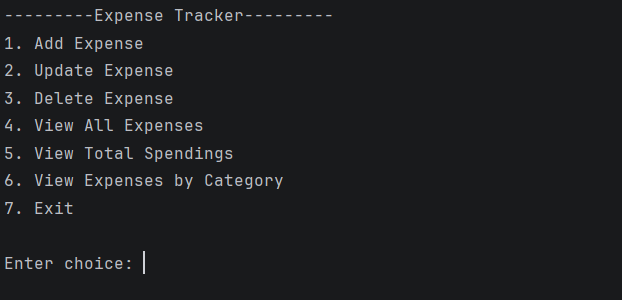
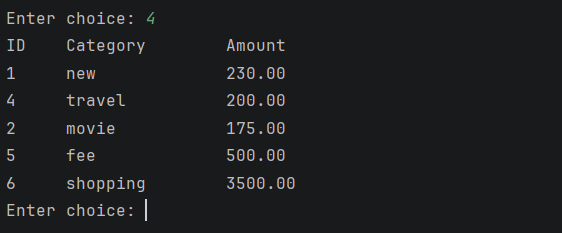
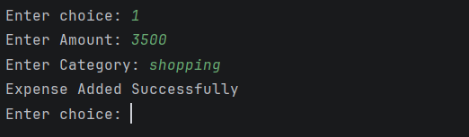
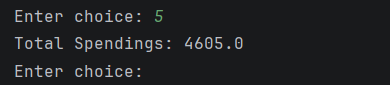

# Expense Tracker (Java JDBC)

A console-based Expense Tracker application built using Java, JDBC, and PostgreSQL. The project allows users to manage expenses and track spending through a menu-driven interface.

## Features

* Add Expense
* View All Expenses
* Search Expenses by Category
* Update Expense
* Delete Expense
* View Total Spending
* Case-Insensitive Category Search
* Input Validation

## Technologies Used

* Java
* JDBC
* PostgreSQL
* Git
* GitHub
* IntelliJ IDEA

## Database Schema

Table: `expenses`

Fields:

* expense_id
* amount
* category

## Concepts Implemented

* JDBC Connection
* PreparedStatement
* ResultSet
* CRUD Operations
* Aggregate Functions (`SUM`)
* Exception Handling
* Try-With-Resources

## How to Run

1. Install PostgreSQL.
2. Create a database.
3. Create the `expenses` table.
4. Update database credentials in the project.
5. Add the PostgreSQL JDBC Driver.
6. Run `Main.java`.

## Screenshots

### Main Menu

### View Expenses

### Add Expense

### Total Spendings

## Learning Outcomes

This project was built to practice:

* Java Database Connectivity (JDBC)
* SQL Queries
* Database Integration with Java
* Object-Oriented Programming Concepts
* Exception Handling

